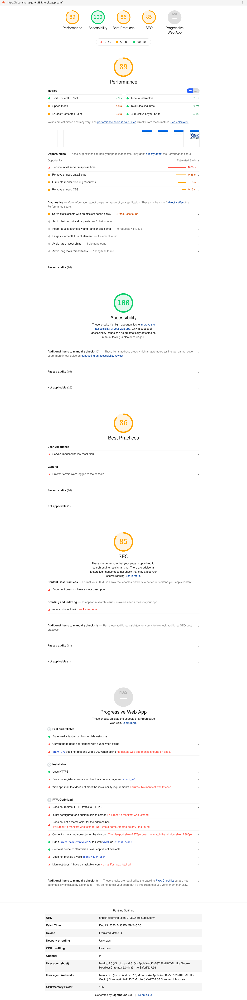

# ipldata

### Search the IPL

> Create a discovery page for IPL where users can search & use facet filters to find different entities – players, teams, owners & venus. Users should be able to filter based on any attributes related to the entity. Make it as easy, intuitive and as less steps as possible for the user to reach a particular entity.

## Lighthouse report



## Project setup

```
npm install
```

### Compiles and hot-reloads for development

```
npm run serve
```

### Compiles and minifies for production

```
npm run build
```

### Lints and fixes files

```
npm run lint
```

### Customize configuration

See [Configuration Reference](https://cli.vuejs.org/config/).
